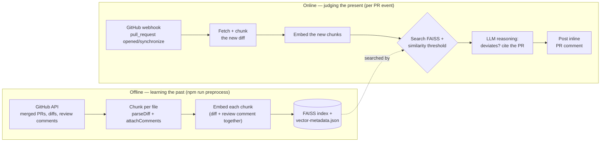

# PR Reviewer


*"The bot that reads your team's diary so you don't have to."*

## What problem does this actually solve?

Every codebase has two kinds of correctness:

1. **Does the code work** — bugs, logic errors, edge cases. Tools like ESLint, SonarQube, Copilot code review, and CodeRabbit already do this well.
2. **Does the code fit** — does it match how *this specific team* does things. Example: "we always validate input at the API boundary, never deep inside a service function." Nobody writes this down. It lives in senior engineers' heads and in old PR review comments that get buried within a week.

Generic AI review tools are good at #1 and blind to #2, because #2 isn't in any style guide — it's implicit, and it's different for every codebase. This project's whole bet is: **that implicit knowledge is sitting right there in git history**, in the form of past diffs and the review comments attached to them. Nobody's mined it. That's the gap.

PR Reviewer mines a repo's own merged-PR history, embeds each past code decision alongside the review comment that explains *why* it was made, and on every new PR, retrieves similar past decisions and asks an LLM whether the new code deviates — citing the actual past PR as evidence, as an advisory inline comment, never a blocking check.

## Architecture

Two pipelines that meet in the middle: one learns from the past (offline, run on demand), one judges the present (online, triggered per PR).



## A real example

This isn't hypothetical — here's an actual run against this repo's own history.

**The historical precedent** — [PR #1](https://github.com/tan-isha412/pr_reviewer/pull/1) fixed a bug where `buildIndex.js` could skip a chunk that failed to embed without removing it from the metadata array, silently misaligning FAISS's numeric positions with their metadata. The fix: push to metadata only after the vector is confirmed added, and assert `index.ntotal === metadata.length`.

**The new PR** — [PR #2](https://github.com/tan-isha412/pr_reviewer/pull/2) adds `buildCommentIndex.js`, a new file that reintroduces that exact bug shape: it pushes to `metadata` *before* confirming the paired vector was added.

**What the bot posted** — [a real inline review comment](https://github.com/tan-isha412/pr_reviewer/pull/2#discussion_r3895509066) on the new PR, generated end-to-end by this codebase with no hand-editing:

> **AI Code Review** — Severity: high
>
> The current implementation allows for a potential mismatch between the FAISS index and its associated metadata. The `metadata.push(comment)` operation occurs unconditionally for each comment (line 9), whereas `index.add(vector)` (line 12) is conditional on `embedChunk` successfully returning a vector. If `embedChunk` fails and returns `null` (handled by `if (!vector) continue;` on line 11), the vector is skipped, but the corresponding comment remains in the `metadata` array. This breaks the crucial 1:1 correspondence and ordering between `index.ntotal` and `metadata.length`, an invariant explicitly enforced and deemed critical in `buildIndex.js` (PR #1). To maintain data integrity, `metadata.push(comment)` must only occur if `index.add(vector)` also occurs for the same item, ensuring `index` and `metadata` remain perfectly synchronized.
>
> **Repository Evidence**: https://github.com/tan-isha412/pr_reviewer/pull/1

Verified by hand: PR #1 is genuinely the right precedent here, not a coincidental text match — same bug class, same fix shape.

## Setup

```bash
git clone https://github.com/tan-isha412/pr_reviewer.git
cd pr_reviewer
npm install
cp .env.example .env
```

Fill in `.env`:

| Variable | What it's for |
|---|---|
| `GITHUB_TOKEN` | A token with read access to PRs/diffs on the repo you're indexing, and write access to post review comments on the repo you're watching |
| `GITHUB_WEBHOOK_SECRET` | Any random string — used to verify incoming webhook payloads are really from GitHub |
| `GEMINI_API_KEY` | For embeddings (`gemini-embedding-001`) and reasoning (`gemini-2.5-flash`) |

The server checks all three at startup and exits immediately with a clear error if any are missing, rather than failing confusingly on the first request.

## Running it against your own repo

**1. Build the index from a repo's merged-PR history** (this is the "learning the past" pipeline):

```bash
npm run preprocess -- <owner> <repo>
```

This pulls that repo's merged PRs and review comments, chunks each diff by file, embeds every chunk, and writes `data/processed/faiss.index` + `data/processed/vector-metadata.json`. Re-run it any time you want to refresh the index against newer history.

**2. Start the webhook server:**

```bash
npm start
```

**3. Expose it to GitHub for local testing** — the server needs a public URL for GitHub to deliver webhook events to:

```bash
ngrok http 3000
```

Take the `https://...ngrok-free.app` URL ngrok prints.

**4. Register the webhook** on the repo you want reviewed (Settings → Webhooks → Add webhook):
- Payload URL: `https://<your-ngrok-domain>/webhook`
- Content type: `application/json`
- Secret: the same value as your `GITHUB_WEBHOOK_SECRET`
- Events: "Pull requests"

**5. Open (or update) a PR** on that repo. If it's similar enough to a past decision and the LLM judges it deviates, you'll see an inline review comment citing the historical PR.

### Or with Docker

```bash
docker compose run preprocess   # one-off: build the index (equivalent to step 1)
docker compose up app           # equivalent to step 2
```

You'll still need `ngrok` (or another tunnel/deployment) separately to expose the containerized server for step 3.

## Evaluation

Rather than eyeball a few examples, the retrieval-then-reasoning pipeline is measured against
a held-out, leave-one-out evaluation over 12 real, labeled PRs on this repo. Full methodology,
the labeled dataset, and the "first run wasn't clean and here's what that revealed" story are
in [`eval/README.md`](eval/README.md); raw output is in [`eval/results.json`](eval/results.json).

## Deploying it somewhere always-on

The webhook server is a plain Express app (`app.js`), so it runs on any Node host. Ready-to-use configs are checked in:

- **Render** — [`render.yaml`](render.yaml): a Blueprint that builds with `npm install` and runs `npm start` on the free tier. Connect the repo on [render.com](https://render.com), it picks up the blueprint automatically, and you fill in the three env vars (`GITHUB_TOKEN`, `GITHUB_WEBHOOK_SECRET`, `GEMINI_API_KEY`) in the dashboard.
- **Fly.io** — [`fly.toml`](fly.toml): builds from the existing [`Dockerfile`](Dockerfile). Run `fly launch --copy-config --no-deploy` then `fly secrets set GITHUB_TOKEN=... GITHUB_WEBHOOK_SECRET=... GEMINI_API_KEY=...` and `fly deploy`.

Either way, once it's live: run `npm run preprocess -- <owner> <repo>` for the repo you want indexed (or bake that into a one-off release step), then point that repo's webhook at your deployment's `/webhook` URL instead of an `ngrok` tunnel — everything else in [Running it against your own repo](#running-it-against-your-own-repo) is identical.

## Testing

```bash
npm test
```

Unit tests cover the pure parsing/reasoning logic (`parseDiff`, `attachComments`, `buildChunks`, `dedupeFindings`, `filterBySeverity`, `shouldSkip`, `formatComment`); integration tests exercise `retrieveMatches`, `runReasoner`, and `handleWebhook` against mocked externals — no network calls, so CI stays fast and deterministic.

## Design decisions

| Decision | Why |
|---|---|
| **Node/Express, not Python** | Python has better-documented RAG/embeddings tooling — that's genuinely true. But this project is fullstack (backend + webhook server, eventually a dashboard), and staying in one language end-to-end keeps it simpler to reason about. Trade-off: FAISS's Node bindings are rougher than the Python original, which is part of why this project ships its own minimal `IndexFlatL2` implementation rather than depending on `faiss-node`. |
| **FAISS-style vector search, not a managed vector DB** | Free, local, and a genuinely respected, widely-used approach (originally from Meta) — a good technique to have exercised. The trade-off: FAISS only stores vectors and returns numeric positions on search, it does **not** store metadata alongside vectors the way Chroma does. That means a separate "sidecar" array has to map vector position → chunk metadata by hand — more manual work, and exactly the kind of bookkeeping that caused the metadata-misalignment bug fixed in PR #1 above. |
| **Chunk by file, not by whole PR** | A single PR often touches multiple unrelated files. Embedding the whole PR as one vector would blur unrelated changes together, making retrieval much less precise. Splitting by file means each chunk represents one focused decision, so similarity search finds relevant matches instead of noisy whole-PR comparisons. |
| **Embed diff + review comment together, not just the diff** | The code change alone doesn't explain *why* it was made. A review comment like "validate at the boundary, not deep in the service" is the actual reasoning — the part worth retrieving. Embedding code + comment together captures both what changed and why. |
| **A similarity threshold before trusting a match** | Vector search always returns *something*, even if the closest match is only vaguely related. Without a minimum cutoff, the LLM would sometimes reason over weak, irrelevant "evidence," leading to false-positive flags — the fastest way to make developers ignore the tool entirely. |
| **Advisory comments, never blocking merges** | This tool is sometimes wrong — "does this deviate" is a judgment call, not a deterministic check. Advisory comments respect that this augments human review; it never has the power to block work. |

## Known limitations (deliberate scope, not oversights)

- **Single-repo, not multi-repo.** Each index is built from one repo's own history. Multi-repo support would need per-repo indices and real complexity, with no added value for proving out the core idea.
- **Comments-only, no merge gate.** By design (see above) — this is a PR-time advisor, not CI/CD. Adding a blocking mode would be a fundamentally different (and riskier) product decision, not a missing feature.
- **No dashboard yet.** All output today is inline PR comments. A dashboard for browsing flagged findings, tuning thresholds, or reviewing trends across PRs is a natural v1.1, not required to prove the core retrieval-then-reasoning value.
- **No settings UI.** Thresholds (similarity cutoff, severity filter) are hardcoded constants today. Fine for a single-team deployment; a config UI is polish once there's more than one team using it.
- **Cold-start on sparse history.** A repo with very few merged PRs (or PRs with no review comments) gives the system little to learn from — retrieval will rarely surface a strong match, so the bot will simply stay quiet rather than invent patterns from thin data.
- **Free-tier LLM quota is a real ceiling.** `gemini-2.5-flash` is capped at 20 requests/day on the free tier — enough for casual use or a demo, not for a busy repo. A production deployment needs a paid tier or a slower delivery cadence. (Discovered the hard way mid-[evaluation run](eval/README.md), which now handles it by flagging affected results rather than silently treating an API failure as "no deviation.")

## License

MIT
